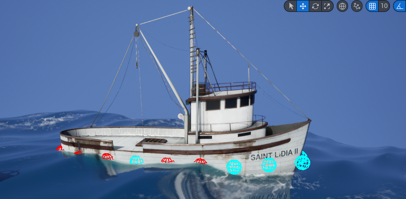

# Buoyancy

The buoyancy system is based on a conventional method of repeating wave calculations performed on the GPU on the CPU. The key distinction lies in the fact that while the GPU computes waves for each vertex of the mesh, the buoyancy system computes waves for limited amount of points, attached to a floating object, known as `BuoyancyPoints`.

<figure><figcaption>
A fishing boat with <code>Buoyancy Points</code> attached to the hull. Red color indicates that the point is below the water surface, cyan — above the water.
</figcaption></figure>


For visualizing Buoyancy Points check `bShowBuoyancyPoints` in the `PlanetaryBounancy` component.


`PlanetaryBuoyancy` component must be attached to an Actor to enable floating. This component computes the depth below (or above) water for a specified array of `BuoyancyPoints` on the CPU. Using this data, it applies forces to the BuoyancyPoints. It also includes built-in gravity.


Gravity can be disabled using `bEnableGravity`, and custom gravity solutions can be used instead.


`PlanetaryOcean` blueprint synchronizes wave parameters between the ocean Dynamic Material Instance and the `PlanetaryBuoyancy` to ensure consistent values for the buoyancy system.


Buoyancy system reacts to translation of an ocean sphere at runtime (when it moves across the world), but doesn't support sphere rotation.



[initial-setup.md](initial-setup.md)



[performance.md](performance.md)

