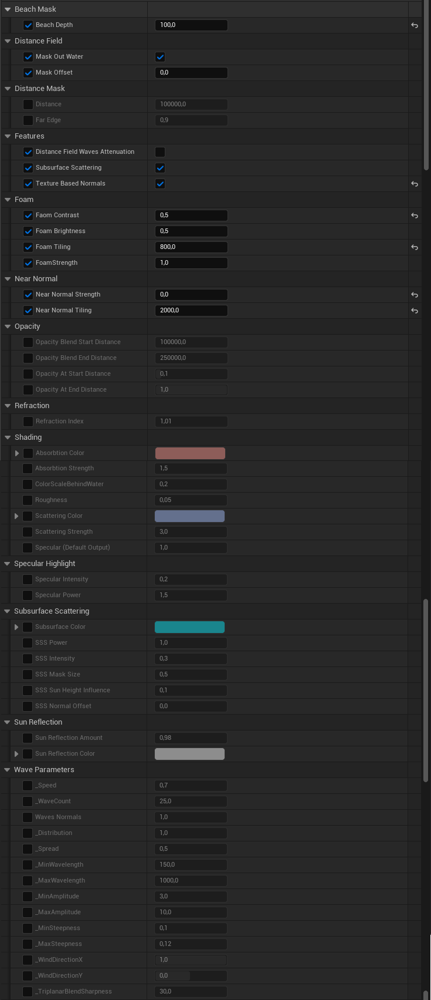

# Using just the material (no buoyancy)

Assign the `MI_PlanetOcean` to the sphere mesh of your choice or use the `SM_OceanMeshGenerated` mesh. To adjust the polygon density, see [Generating ocean mesh](using-with-static-mesh/generating-ocean-mesh.md).

You have a wide variety of parameters that enable you to achieve the desired style. Here are some features:

* Wave parameters (direction, length, amplitude, steepness etc.)
* Subsurface scattering
* Waves attenuation at the shoreline
* Masking out water
* Waves and beach foam
* Scrolling normals (textures) on top of wave normals

<figure><figcaption></figcaption></figure>
